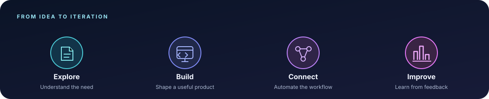
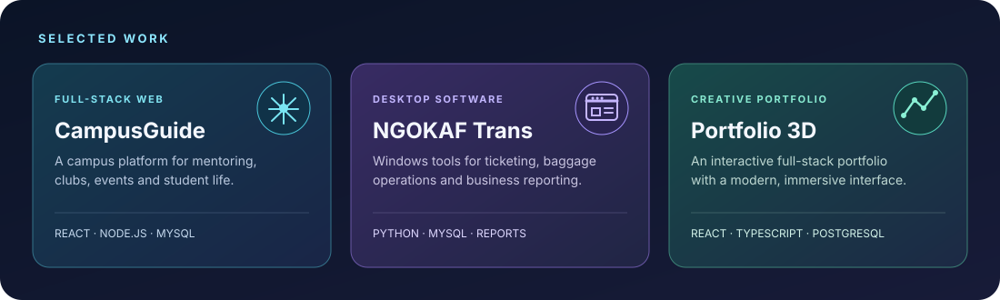

  
  
  

## About

I’m a computer science student and software developer interested in building practical web products, desktop tools, and workflow automations. I enjoy taking an idea from its first sketch to a working application.

## Toolkit

  

## Selected projects

- [CampusGuide](https://github.com/bonheur84/CampusGuide) — a full-stack campus platform for mentoring, clubs, and events.
- [NGOKAF Trans](https://github.com/bonheur84/NGOKAF-Trans) — a Windows desktop system for ticketing, baggage, and transport operations.
- [Portfolio](https://github.com/bonheur84/portfolio) — an interactive portfolio built with a React frontend and an Express/PostgreSQL backend.

## GitHub activity

## Currently exploring

- Robotics, embedded systems, and drone programming
- Better ways to connect software, data, and everyday workflows

---

  Thanks for stopping by. I’m always happy to connect with people who enjoy building useful things.

